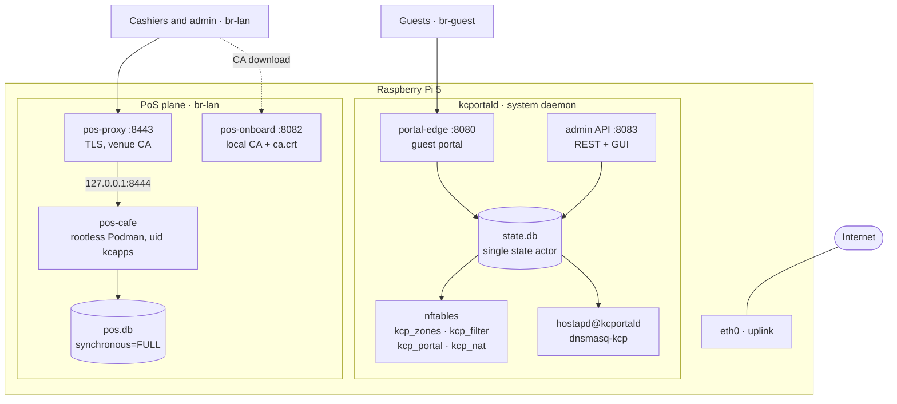
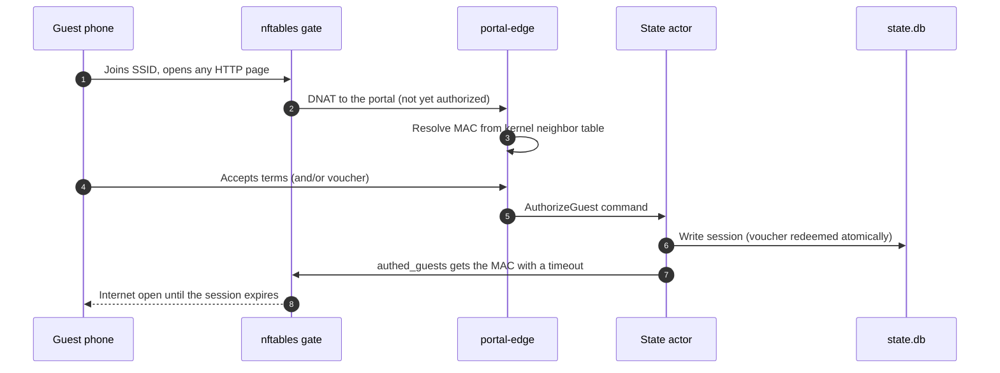
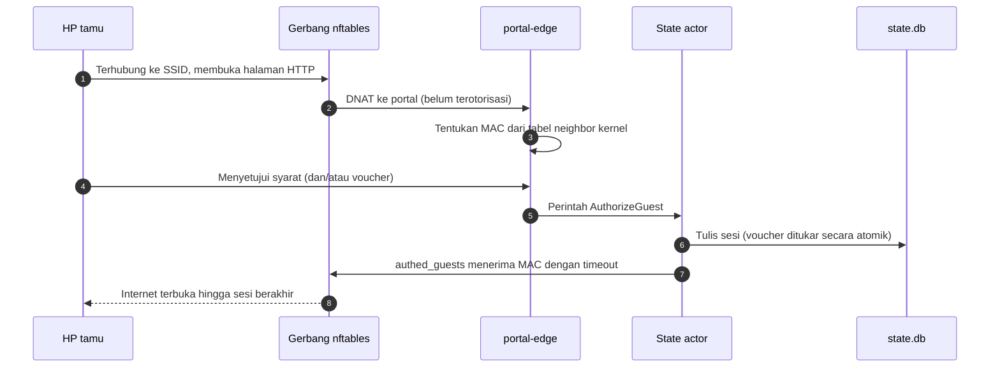

<div align="center">

# kotacloud-portal

### A captive-portal Wi-Fi router and Point-of-Sale App Pack — in one box, in one Go daemon.
### Router Wi-Fi captive portal dan App Pack Point-of-Sale — dalam satu perangkat, satu daemon Go.

[](go.mod)
[](#device-notes)
[](#architecture)
[](#pos-app-pack)
[](#repository-layout)
[](#milestone-status)

**🌐 Language / Bahasa** — click a section below to expand it · klik bagian di bawah untuk membuka

</div>

<details open>
<summary><b>🇬🇧 &nbsp;English</b></summary>

## Overview

`kcportald` is a single daemon that turns a Raspberry Pi 5 into the whole network and payment stack of a small venue:

| Plane | What it does |
|---|---|
| **Router** | nftables enforcement, DHCP/DNS, Wi-Fi access points, per-client bandwidth limits |
| **Guest portal** | Consent-first captive portal with vouchers, time-boxed sessions and a DoH/DoT shield |
| **Admin** | REST API plus an embedded web GUI (devices, sessions, vouchers, zones, audit log) |
| **PoS** | A rootless-containerized point-of-sale behind venue-local TLS, with ESC/POS receipt printing |

> **Status:** M0–M4 are **complete and verified live on a Pi 5** — router, captive portal, admin GUI, DoH shield and the PoS App Pack.
> M5 (fleet server) is next. See the [roadmap](docs/ROADMAP.md) and the [milestone status](#milestone-status).

### Table of contents

1. [Features](#features)
2. [Architecture](#architecture)
3. [Quick start](#quick-start)
4. [Operating guide](#operating-guide)
5. [Security model](#security-model)
6. [Repository layout](#repository-layout)
7. [Milestone status](#milestone-status)
8. [Device notes](#device-notes)
9. [Documentation](#documentation)
10. [License](#license)

---

## Features

### Guest internet, the safe way

| Capability | How it works |
|---|---|
| **Consent-first portal** | Accepting the terms is required; marketing opt-in and voucher redemption are optional. |
| **Trustworthy identity** | The client's MAC is resolved **only** from the kernel neighbor table (IP → MAC) — never from client-supplied data. |
| **Native "sign in" popup** | OS captive probes (`/generate_204` and friends) receive a `302`, so Android, iOS and Windows open their own portal window. |
| **DoH / DoT shield** | Bootstrap IPs of public resolvers (Cloudflare, Google, Quad9, OpenDNS, AdGuard) and port 853 are dropped for guests. Android Private DNS falls back to the venue DNS, so the portal flow always wins. Live drop counters are shown in the admin GUI. |
| **Time-boxed sessions** | Sessions live in the `authed_guests` nftables set with per-element timeouts. Revocation follows the §4.6 ordering: **kernel first, radio second** (deauthentication). |
| **Vouchers** | Server-generated 10-character codes from an unambiguous alphabet, with a duration and a maximum number of uses. |

### Single-box router

- **Declarative ruleset.** Desired state in SQLite (`state.db`) → rendered `kcp.nft` → validated with `nft -c` → installed atomically with `nft -f` (never `flush ruleset`). A 30 s drift loop re-applies the ruleset if anything changes underneath it.
- **Commit-confirm (ADR-006).** Risky changes start a 60 s trial and roll back automatically to the last-good snapshot unless confirmed — from the API, the GUI, or the boot path after a crash.
- **Zones.** `waiting` · `admin` · `pos` · `guest`, with MAC classification, anti-spoof MAC↔IP bindings (SEC-012), per-client guest bandwidth limits, an SMTP block and conntrack caps.
- **Generated Wi-Fi config.** hostapd and dnsmasq configuration is rendered from state; restarts go through polkit-pinned `systemctl`, and per-device DHCP reservations ride dnsmasq's inotify (no restarts).

### Administration

- **REST API** at `/api/v1/*` with bearer-token auth on a **loopback-only** listener.
- **Embedded React GUI:**

  | Tab | Purpose |
  |---|---|
  | Wizard | WAN posture view |
  | Devices | Approve or block detected devices per zone |
  | Guests | Live sessions with one-click revoke |
  | Voucher | Generate vouchers and track usage |
  | Zones | Zone policy edits (ride commit-confirm) |
  | Audit | Hash-chained, tamper-evident action log |

### PoS App Pack

- **Rootless by design.** `pos-cafe` runs in Podman (Quadlet) as uid `kcapps` behind a **default-deny egress chain** (`meta skuid`) — only explicitly allowed destinations pass.
- **Cashier UI.** Embedded React app with PIN login (argon2id), shifts (single-open rule enforced by the database), orders with per-day receipt numbers (`YYMMDD-0001`), cash and manual-QRIS payments with idempotency keys, and admin-only void with audited reasons.
- **Receipts.** ESC/POS 58 mm renderer with USB and raw-TCP drivers. The print job is committed **in the same transaction as the payment** (FR-POS-007); a worker drains the queue with backoff.
- **Durable storage.** `pos.db` is fully decoupled from `state.db` (§6.5): `synchronous=FULL`, single write connection — **0 lost transactions on power cut** (NFR-POS-03).
- **TLS everywhere.** A venue-local CA (T1) is served by `pos-onboard`, TLS is terminated by `pos-proxy` (`:8443`), and the app listens on loopback only.

---

## Architecture

### System view



### How a guest gets online



### Zones

| Zone | Mark | Who | Notes |
|---|---|---|---|
| `waiting` | `0x00` | Unclassified LAN devices | DNS answered with REFUSED, plain HTTP gets an info page |
| `admin` | `0x01` | Management plane | Operator access |
| `pos` | `0x02` | Cashier devices | Reach the PoS proxy (`:8443`) and onboarding (`:8082`) |
| `guest` | `0x03` | Captive guests | Identity = segment (`br-guest`) |

### Design invariants

- **One state writer.** Every change is a command handled by a single actor; nothing else mutates `state.db`.
- **Generated config, never hand-edited.** nftables, hostapd and dnsmasq files are rendered from state.
- **Fail-closed everywhere.** `nft -c` runs before `nft -f`, bridges must exist before listeners start, and egress is default-deny.
- **Secrets stay out of `app.yaml`.** Sensitive values are injected at render time or kept in dedicated stores (§7.3).

---

## Quick start

> **Requirements:** Raspberry Pi 5 running Debian 13, root access, and this repository cloned on the Pi. Go is needed to build; `sshpass` is **not** needed on the Pi itself.

```sh
# 1. Router interfaces (bridges, addresses, forwarding).
#    Manual and reviewed by design — this step can cut management access.
sudo deploy/pi/kcp-net-apply.sh --keep-eth0

# 2. Run the daemon
sudo systemctl enable --now kcportald          # production posture
#   or: go run ./cmd/kcportald -dev            # laptop dry-run (no kernel writes)

# 3. Get the admin API token
sudo kcportald -api-token

# 4. Open the admin GUI through an SSH tunnel (the listener is loopback-only)
ssh -N -L 18083:127.0.0.1:8083 <user>@<pi-ip>
#    then browse http://localhost:18083
```

Day-to-day operation is covered in the [Operating guide](#operating-guide).

### PoS App Pack

```sh
sudo deploy/pi/pos/pos-setup.sh                # podman, kcapps user, units
deploy/pi/pos/build-pos-image.sh               # build the image ON the Pi
# install pos-proxy / pos-onboard binaries + units (see deploy/pi/pos/README.md)
sudo deploy/pi/pos/verify-pos.sh               # acceptance: 14 checks + power-cut drill
```

Printer wiring (USB and LAN), cashier browser onboarding and the binary update flow are documented in [`deploy/pi/pos/README.md`](deploy/pi/pos/README.md).

---

## Operating guide

### Admin GUI and API

The admin listener is **loopback-only by design** (`127.0.0.1:8083`) and is never exposed to the LAN. Reach it through an SSH tunnel and paste the bearer token:

```sh
ssh -N -L 18083:127.0.0.1:8083 <user>@<pi-ip>
# open http://localhost:18083
```

`sudo kcportald -api-token` prints the token. The browser stores it locally and every API call re-authenticates with it.

### The guest experience

1. **Join** the guest SSID — the OS shows "sign in to network" and **opens the portal automatically**. Any plain-HTTP site redirects there too.
2. **Accept the terms** (marketing optional) **or redeem a voucher** — the session opens within seconds (`authed_guests` plus the 30 s drift loop).
3. **Browse** for the session duration. Expiry or revocation locks the device again; reconnecting reopens the portal.

DNS is pinned to the venue resolver for guests, so devices cannot slip past the portal via encrypted DNS.

### Vouchers

**GUI:** *Voucher* tab → quantity / duration (minutes) / max uses → **Generate**.

```sh
# Create
curl -X POST http://127.0.0.1:8083/api/v1/vouchers \
  -H "Authorization: Bearer $TOKEN" -H "Content-Type: application/json" \
  -d '{"count":2,"duration_s":1800,"max_uses":1}'
# → {"ok":true,"codes":["GPC795A3RT","..."]}

# Delete (already-started sessions keep their own expiry; 404 if unknown)
curl -X DELETE http://127.0.0.1:8083/api/v1/vouchers/GPC795A3RT \
  -H "Authorization: Bearer $TOKEN"
# → {"ok":true,"deleted":"GPC795A3RT"}
```

Each redemption opens one session for `duration_s`; a voucher allows `max_uses` redemptions in total.

### Session control

```sh
sudo kcportald -approve aa:bb:cc:dd:ee:ff   # grant a 60-minute session
sudo kcportald -revoke  aa:bb:cc:dd:ee:ff   # close all sessions for that MAC
```

Both go through `state.db` and the drift loop (≤ 30 s): the MAC leaves the kernel gate and the radio deauth is best-effort. The **Guests** tab does the same per device.

### Health and recovery cheat sheet

```sh
systemctl is-active kcportal-netsetup kcportald hostapd@kcportald dnsmasq-kcp
hostapd_cli -p /run/kcportal/hostapd -i wlan0 status | grep -E 'state|freq'
ip -br a show br-guest                      # 10.20.3.1/24 must be present
sudo nft -f /run/kcportal/last-good.nft     # emergency ruleset rollback
```

Bridges, gateway addresses and IP forwarding are re-applied at **every boot** by `kcportal-netsetup.service`. If the guest SSID is missing after a reboot, a failing `kcportal-netsetup` is the first suspect (`systemctl status kcportal-netsetup`).

The full outage post-mortem and a synthetic-guest diagnostic technique (netns + veth + `nft monitor trace`, no phone required) live in [`deploy/pi/RECOVERY.md`](deploy/pi/RECOVERY.md).

---

## Security model

| Layer | Measure |
|---|---|
| **Network** | nftables `policy drop` on input and forward, invalid-state drop, MAC↔IP anti-spoof binding, DoH/DoT/DoQ drop for guests, per-guest rate limits |
| **Change safety** | `nft -c` before `nft -f`, atomic install, 60 s commit-confirm with automatic rollback, hash-chained audit log |
| **Admin plane** | Loopback-only listener, bearer token, strict JSON decoding (unknown fields rejected), `Cache-Control: no-store` |
| **Daemon** | Runs as an unprivileged user with only `CAP_NET_ADMIN` and `CAP_NET_RAW`; `NoNewPrivileges`, `ProtectSystem=strict`; polkit allows restarting exactly two units |
| **PoS** | Rootless container, default-deny egress, argon2id PIN hashing, `HttpOnly` + `SameSite=Strict` session cookie, TLS ≥ 1.2 with a venue-local CA, app bound to loopback |
| **Data** | Parameterized SQL only; no shell invocation (all external commands use argument arrays); `pos.db` separated from `state.db` |

> Lab credentials used during development must never be committed or reused in production. Prefer SSH keys over passwords, and rotate the admin token after first use.

---

## Repository layout

```text
cmd/
├─ kcportald            single daemon — wires everything below
├─ pos-cafe             PoS application (App Pack, rootless container)
├─ pos-proxy            TLS terminator :8443 → pos-cafe
├─ pos-onboard          venue-local CA + ca.crt download :8082
└─ dhcp-hook            dnsmasq lease-event helper

internal/
├─ api                  REST admin API + embedded web GUI mount
├─ config               app.yaml shape + validation
├─ confirm              commit-confirm manager (ADR-006)
├─ core                 command / result / actor / event bus (IF-02, PD-3)
├─ listen               portal-edge (guest portal), waiting-* listeners
├─ net                  netctl (IF-01), nft renderer, dhcp, wifi, netlink
├─ pos                  pos.db store, local PKI, ESC/POS printer, cashier UI
├─ portal               guest session domain (DD-11 pseudonym, view model)
├─ reconcile            state actor handler: state.db → Plan → nft
├─ runtimecfg           hostapd / dnsmasq renderers + restart plumbing
├─ store                state.db (SQLite) + migrations
├─ supervisor           task lifecycle runner
└─ watchers             dhcp-hook and neighbor (netlink) watchers

web/
├─ admin                React admin GUI
├─ portal               React captive page
└─ pos                  React cashier UI

deploy/pi/              deployment scripts, units and docs for the Pi
docs/                   ROADMAP.md · M4-plan.md
server/                 fleet backend (M5 — not implemented yet)
```

---

## Milestone status

| Milestone | Scope | Status |
|---|---|:---:|
| **M0** | Skeleton, `state.db` schema, actor/bus, CI | ✅ Done |
| **M1** | `state.db` → Plan → nft pipeline, commit-confirm | ✅ Done |
| **M2** | Wi-Fi APs, DHCP/DNS, DEAUTH enforcement, Pi live | ✅ Done |
| **M3** | Guest portal, REST admin, web GUIs, DoH shield | ✅ Done |
| **M4** | PoS App Pack (Podman, TLS, PoS app, egress deny) | ✅ Done |
| **M5** | Fleet server (enroll, poll/ack, marketing sync) | 🗓 Planned |
| **M6** | Public TLS (ACME), DoT upstream, hardening | 🗓 Planned |

**Verification.** `go test -race ./...` is green, the ruleset is covered by golden-file tests, and acceptance runs live on the Pi (`deploy/pi/pos/verify-pos.sh`, 14 checks). Per-milestone evidence is in [`docs/M4-plan.md`](docs/M4-plan.md). The full guest-portal cycle was validated on **real devices** (2026-10-01): connect → OS portal auto-open → voucher → internet → revoke → locked again (see [`deploy/pi/RECOVERY.md`](deploy/pi/RECOVERY.md)).

---

## Device notes

**Raspberry Pi 5 / CYW43455**

- The onboard radio reports `#{ AP } <= 1`, so only **one BSS** is possible (the guest portal one). DD-01's dual BSS returns with a second radio.
- The guest SSID runs on **2.4 GHz** (`hw_mode g`, channel 6, HT20) — the 5 GHz band kept some phones from ever associating.
- hostapd 2.10 on this firmware emits **no `AP-STA-*` control events** (verified with two independent listeners). Enforcement is unaffected: the reconciler owns state and DEAUTH is best-effort radio hygiene.

---

## Documentation

| Document | Contents |
|---|---|
| [`docs/ROADMAP.md`](docs/ROADMAP.md) | Milestones and open gaps |
| [`docs/M4-plan.md`](docs/M4-plan.md) | PoS plan with live evidence |
| [`deploy/pi/README-production.md`](deploy/pi/README-production.md) | Production deployment |
| [`deploy/pi/RECOVERY.md`](deploy/pi/RECOVERY.md) | Lockout recovery |
| [`deploy/pi/pos/README.md`](deploy/pi/pos/README.md) | PoS operations |

---

## License

All rights reserved. Internal project — licensing will be decided before any distribution.

<div align="center">

**Made for the café pilot · Raspberry Pi 5 · Go**

[⬆ Back to top](#kotacloud-portal)

</div>

</details>

<details>
<summary><b>🇮🇩 &nbsp;Bahasa Indonesia</b></summary>

## Ringkasan

`kcportald` adalah satu daemon yang mengubah Raspberry Pi 5 menjadi seluruh tumpukan jaringan dan pembayaran untuk sebuah tempat usaha kecil:

| Bidang | Fungsi |
|---|---|
| **Router** | Penegakan aturan nftables, DHCP/DNS, access point Wi-Fi, pembatasan bandwidth per klien |
| **Portal tamu** | Captive portal berbasis persetujuan dengan voucher, sesi berbatas waktu, dan perisai DoH/DoT |
| **Admin** | REST API plus GUI web tertanam (perangkat, sesi, voucher, zona, log audit) |
| **PoS** | Point-of-sale dalam kontainer rootless di balik TLS lokal venue, dengan cetak struk ESC/POS |

> **Status:** M0–M4 **selesai dan terverifikasi langsung di Pi 5** — router, captive portal, GUI admin, perisai DoH, dan PoS App Pack.
> M5 (server fleet) adalah tahap berikutnya. Lihat [roadmap](docs/ROADMAP.md) dan [status milestone](#status-milestone).

### Daftar isi

1. [Fitur](#fitur)
2. [Arsitektur](#arsitektur)
3. [Mulai Cepat](#mulai-cepat)
4. [Panduan Operasional](#panduan-operasional)
5. [Model Keamanan](#model-keamanan)
6. [Struktur Repositori](#struktur-repositori)
7. [Status Milestone](#status-milestone)
8. [Catatan Perangkat](#catatan-perangkat)
9. [Dokumentasi](#dokumentasi)
10. [Lisensi](#lisensi)

---

## Fitur

### Internet tamu yang aman

| Kemampuan | Cara kerja |
|---|---|
| **Portal berbasis persetujuan** | Persetujuan syarat & ketentuan wajib; opt-in pemasaran dan penukaran voucher bersifat opsional. |
| **Identitas yang tepercaya** | MAC klien ditentukan **hanya** dari tabel neighbor kernel (IP → MAC), tidak pernah dari data kiriman klien. |
| **Popup "masuk jaringan" bawaan OS** | Probe captive OS (`/generate_204` dan sejenisnya) dijawab `302`, sehingga Android, iOS, dan Windows membuka jendela portalnya sendiri. |
| **Perisai DoH / DoT** | IP bootstrap resolver publik (Cloudflare, Google, Quad9, OpenDNS, AdGuard) dan port 853 di-drop untuk tamu. Private DNS Android kembali memakai DNS venue, sehingga alur portal selalu berjalan. Penghitung drop langsung tampil di GUI admin. |
| **Sesi berbatas waktu** | Sesi disimpan di set nftables `authed_guests` dengan timeout per elemen. Pencabutan mengikuti urutan §4.6: **kernel dulu, radio kemudian** (deautentikasi). |
| **Voucher** | Kode 10 karakter yang dibuat server dari alfabet tanpa karakter membingungkan, dengan durasi dan jumlah pemakaian maksimum. |

### Router dalam satu perangkat

- **Ruleset deklaratif.** Status yang diinginkan di SQLite (`state.db`) → dirender menjadi `kcp.nft` → divalidasi dengan `nft -c` → dipasang secara atomik dengan `nft -f` (tidak pernah `flush ruleset`). Loop drift 30 detik menerapkan ulang ruleset bila ada yang berubah di bawahnya.
- **Commit-confirm (ADR-006).** Perubahan berisiko memulai masa uji 60 detik dan otomatis di-rollback ke snapshot terakhir yang baik kecuali dikonfirmasi — lewat API, GUI, atau jalur boot setelah crash.
- **Zona.** `waiting` · `admin` · `pos` · `guest`, dengan klasifikasi MAC, binding MAC↔IP anti-spoof (SEC-012), batas bandwidth tamu per klien, blokir SMTP, dan batas conntrack.
- **Konfigurasi Wi-Fi yang dihasilkan otomatis.** Konfigurasi hostapd dan dnsmasq dirender dari state; restart lewat `systemctl` yang dikunci polkit, dan reservasi DHCP per perangkat memanfaatkan inotify dnsmasq (tanpa restart).

### Administrasi

- **REST API** di `/api/v1/*` dengan autentikasi bearer token pada listener **khusus loopback**.
- **GUI React tertanam:**

  | Tab | Fungsi |
  |---|---|
  | Wizard | Tampilan postur WAN |
  | Devices | Setujui atau blokir perangkat terdeteksi per zona |
  | Guests | Sesi aktif dengan tombol revoke sekali klik |
  | Voucher | Buat voucher dan pantau pemakaiannya |
  | Zones | Ubah kebijakan zona (melalui commit-confirm) |
  | Audit | Log tindakan berantai hash yang tahan manipulasi |

### PoS App Pack

- **Rootless sejak desain.** `pos-cafe` berjalan di Podman (Quadlet) sebagai uid `kcapps` di balik **rantai egress default-deny** (`meta skuid`) — hanya tujuan yang diizinkan eksplisit yang lolos.
- **UI kasir.** Aplikasi React tertanam dengan login PIN (argon2id), shift (aturan satu shift terbuka ditegakkan oleh database), pesanan dengan nomor struk per hari (`YYMMDD-0001`), pembayaran tunai dan QRIS manual dengan idempotency key, serta void khusus admin dengan alasan yang diaudit.
- **Struk.** Renderer ESC/POS 58 mm dengan driver USB dan raw-TCP. Job cetak di-commit **dalam transaksi yang sama dengan pembayaran** (FR-POS-007); worker menguras antrean dengan backoff.
- **Penyimpanan tahan banting.** `pos.db` sepenuhnya terpisah dari `state.db` (§6.5): `synchronous=FULL`, satu koneksi tulis — **0 transaksi hilang saat listrik mati** (NFR-POS-03).
- **TLS di semua sisi kasir.** CA lokal venue (T1) disajikan oleh `pos-onboard`, TLS diterminasi oleh `pos-proxy` (`:8443`), dan aplikasi hanya mendengarkan di loopback.

---

## Arsitektur

### Gambaran sistem


### Bagaimana tamu bisa online



### Zona

| Zona | Mark | Siapa | Catatan |
|---|---|---|---|
| `waiting` | `0x00` | Perangkat LAN yang belum diklasifikasi | DNS dijawab REFUSED, HTTP biasa mendapat halaman info |
| `admin` | `0x01` | Bidang manajemen | Akses operator |
| `pos` | `0x02` | Perangkat kasir | Menjangkau proxy PoS (`:8443`) dan onboarding (`:8082`) |
| `guest` | `0x03` | Tamu captive | Identitas = segmen (`br-guest`) |

### Invarian desain

- **Satu penulis state.** Setiap perubahan adalah perintah yang ditangani satu actor; tidak ada yang lain yang mengubah `state.db`.
- **Konfigurasi dihasilkan, tidak diedit manual.** File nftables, hostapd, dan dnsmasq dirender dari state.
- **Fail-closed di mana-mana.** `nft -c` dijalankan sebelum `nft -f`, bridge harus ada sebelum listener dimulai, dan egress default-deny.
- **Rahasia di luar `app.yaml`.** Nilai sensitif disuntikkan saat render atau disimpan di penyimpanan khusus (§7.3).

---

## Mulai Cepat

> **Prasyarat:** Raspberry Pi 5 dengan Debian 13, akses root, dan repositori ini sudah di-clone di Pi. Go diperlukan untuk build; `sshpass` **tidak** dibutuhkan di Pi itu sendiri.

```sh
# 1. Antarmuka router (bridge, alamat, forwarding).
#    Manual dan ditinjau dengan sengaja — langkah ini bisa memutus akses manajemen.
sudo deploy/pi/kcp-net-apply.sh --keep-eth0

# 2. Jalankan daemon
sudo systemctl enable --now kcportald          # postur produksi
#   atau: go run ./cmd/kcportald -dev          # dry-run di laptop (tanpa tulis ke kernel)

# 3. Ambil token admin API
sudo kcportald -api-token

# 4. Buka GUI admin lewat SSH tunnel (listener hanya loopback)
ssh -N -L 18083:127.0.0.1:8083 <user>@<pi-ip>
#    lalu buka http://localhost:18083
```

Operasi harian dibahas di [Panduan Operasional](#panduan-operasional).

### PoS App Pack

```sh
sudo deploy/pi/pos/pos-setup.sh                # podman, user kcapps, unit
deploy/pi/pos/build-pos-image.sh               # build image DI Pi
# pasang binary pos-proxy / pos-onboard + unit (lihat deploy/pi/pos/README.md)
sudo deploy/pi/pos/verify-pos.sh               # akseptansi: 14 cek + simulasi listrik mati
```

Pemasangan printer (USB dan LAN), onboarding browser kasir, dan alur pembaruan binary ada di [`deploy/pi/pos/README.md`](deploy/pi/pos/README.md).

---

## Panduan Operasional

### GUI dan API admin

Listener admin **khusus loopback secara desain** (`127.0.0.1:8083`) dan tidak pernah diekspos ke LAN. Akses lewat SSH tunnel lalu tempel bearer token:

```sh
ssh -N -L 18083:127.0.0.1:8083 <user>@<pi-ip>
# buka http://localhost:18083
```

`sudo kcportald -api-token` mencetak token. Browser menyimpannya secara lokal dan setiap panggilan API diautentikasi ulang dengannya.

### Pengalaman tamu

1. **Hubungkan** ke SSID tamu — OS menampilkan "masuk ke jaringan" dan **membuka portal otomatis**. Situs HTTP biasa juga dialihkan ke sana.
2. **Setujui syarat** (pemasaran opsional) **atau tukar voucher** — sesi terbuka dalam hitungan detik (`authed_guests` plus loop drift 30 detik).
3. **Berselancar** selama durasi sesi. Kedaluwarsa atau pencabutan mengunci perangkat lagi; menyambung ulang akan membuka portal kembali.

DNS untuk tamu dikunci ke resolver venue, sehingga perangkat tidak bisa melewati portal lewat DNS terenkripsi.

### Voucher

**GUI:** tab *Voucher* → jumlah / durasi (menit) / maks. pakai → **Generate**.

```sh
# Buat
curl -X POST http://127.0.0.1:8083/api/v1/vouchers \
  -H "Authorization: Bearer $TOKEN" -H "Content-Type: application/json" \
  -d '{"count":2,"duration_s":1800,"max_uses":1}'
# → {"ok":true,"codes":["GPC795A3RT","..."]}

# Hapus (sesi yang sudah berjalan tetap memakai masa berlakunya; 404 jika tidak dikenal)
curl -X DELETE http://127.0.0.1:8083/api/v1/vouchers/GPC795A3RT \
  -H "Authorization: Bearer $TOKEN"
# → {"ok":true,"deleted":"GPC795A3RT"}
```

Setiap penukaran membuka satu sesi selama `duration_s`; satu voucher boleh ditukar total `max_uses` kali.

### Kontrol sesi

```sh
sudo kcportald -approve aa:bb:cc:dd:ee:ff   # beri sesi 60 menit
sudo kcportald -revoke  aa:bb:cc:dd:ee:ff   # tutup semua sesi untuk MAC itu
```

Keduanya lewat `state.db` dan loop drift (≤ 30 detik): MAC keluar dari gerbang kernel dan deauth radio bersifat best-effort. Tab **Guests** melakukan hal yang sama per perangkat.

### Cheat sheet kesehatan dan pemulihan

```sh
systemctl is-active kcportal-netsetup kcportald hostapd@kcportald dnsmasq-kcp
hostapd_cli -p /run/kcportal/hostapd -i wlan0 status | grep -E 'state|freq'
ip -br a show br-guest                      # 10.20.3.1/24 harus ada
sudo nft -f /run/kcportal/last-good.nft     # rollback ruleset darurat
```

Bridge, alamat gateway, dan IP forwarding diterapkan ulang pada **setiap boot** oleh `kcportal-netsetup.service`. Jika SSID tamu hilang setelah reboot, `kcportal-netsetup` yang gagal adalah tersangka pertama (`systemctl status kcportal-netsetup`).

Post-mortem gangguan lengkap dan teknik diagnosis tamu sintetis (netns + veth + `nft monitor trace`, tanpa perlu HP) ada di [`deploy/pi/RECOVERY.md`](deploy/pi/RECOVERY.md).

---

## Model Keamanan

| Lapisan | Langkah |
|---|---|
| **Jaringan** | nftables `policy drop` pada input dan forward, drop state invalid, binding anti-spoof MAC↔IP, drop DoH/DoT/DoQ untuk tamu, batas laju per tamu |
| **Keamanan perubahan** | `nft -c` sebelum `nft -f`, pemasangan atomik, commit-confirm 60 detik dengan rollback otomatis, log audit berantai hash |
| **Bidang admin** | Listener khusus loopback, bearer token, dekode JSON ketat (field tak dikenal ditolak), `Cache-Control: no-store` |
| **Daemon** | Berjalan sebagai user tanpa hak istimewa dengan hanya `CAP_NET_ADMIN` dan `CAP_NET_RAW`; `NoNewPrivileges`, `ProtectSystem=strict`; polkit hanya mengizinkan restart dua unit |
| **PoS** | Kontainer rootless, egress default-deny, hash PIN argon2id, cookie sesi `HttpOnly` + `SameSite=Strict`, TLS ≥ 1.2 dengan CA lokal venue, aplikasi terikat ke loopback |
| **Data** | Hanya SQL berparameter; tanpa pemanggilan shell (semua perintah eksternal memakai array argumen); `pos.db` dipisah dari `state.db` |

> Kredensial lab yang dipakai saat pengembangan tidak boleh di-commit atau dipakai ulang di produksi. Utamakan kunci SSH daripada password, dan putar (rotate) token admin setelah pemakaian pertama.

---

## Struktur Repositori

```text
cmd/
├─ kcportald            daemon tunggal — merangkai semua komponen di bawah
├─ pos-cafe             aplikasi PoS (App Pack, kontainer rootless)
├─ pos-proxy            terminator TLS :8443 → pos-cafe
├─ pos-onboard          CA lokal venue + unduh ca.crt :8082
└─ dhcp-hook            helper event lease dnsmasq

internal/
├─ api                  REST API admin + mount GUI web tertanam
├─ config               bentuk + validasi app.yaml
├─ confirm              manajer commit-confirm (ADR-006)
├─ core                 command / result / actor / event bus (IF-02, PD-3)
├─ listen               portal-edge (portal tamu), listener waiting-*
├─ net                  netctl (IF-01), renderer nft, dhcp, wifi, netlink
├─ pos                  store pos.db, PKI lokal, printer ESC/POS, UI kasir
├─ portal               domain sesi tamu (pseudonim DD-11, view model)
├─ reconcile            handler state actor: state.db → Plan → nft
├─ runtimecfg           renderer hostapd / dnsmasq + plumbing restart
├─ store                state.db (SQLite) + migrasi
├─ supervisor           runner siklus hidup task
└─ watchers             watcher dhcp-hook dan neighbor (netlink)

web/
├─ admin                GUI admin React
├─ portal               halaman captive React
└─ pos                  UI kasir React

deploy/pi/              skrip deploy, unit, dan dokumen untuk Pi
docs/                   ROADMAP.md · M4-plan.md
server/                 backend fleet (M5 — belum diimplementasikan)
```

---

## Status Milestone

| Milestone | Cakupan | Status |
|---|---|:---:|
| **M0** | Kerangka, skema `state.db`, actor/bus, CI | ✅ Selesai |
| **M1** | Pipeline `state.db` → Plan → nft, commit-confirm | ✅ Selesai |
| **M2** | AP Wi-Fi, DHCP/DNS, penegakan DEAUTH, Pi live | ✅ Selesai |
| **M3** | Portal tamu, REST admin, GUI web, perisai DoH | ✅ Selesai |
| **M4** | PoS App Pack (Podman, TLS, aplikasi PoS, egress deny) | ✅ Selesai |
| **M5** | Server fleet (enroll, poll/ack, sinkronisasi pemasaran) | 🗓 Direncanakan |
| **M6** | TLS publik (ACME), upstream DoT, hardening | 🗓 Direncanakan |

**Verifikasi.** `go test -race ./...` hijau, ruleset dicakup tes golden-file, dan akseptansi berjalan langsung di Pi (`deploy/pi/pos/verify-pos.sh`, 14 cek). Bukti per milestone ada di [`docs/M4-plan.md`](docs/M4-plan.md). Siklus penuh portal tamu divalidasi pada **perangkat nyata** (2026-10-01): sambung → portal terbuka otomatis di OS → voucher → internet → revoke → terkunci lagi (lihat [`deploy/pi/RECOVERY.md`](deploy/pi/RECOVERY.md)).

---

## Catatan Perangkat

**Raspberry Pi 5 / CYW43455**

- Radio onboard melaporkan `#{ AP } <= 1`, sehingga hanya **satu BSS** yang mungkin (BSS portal tamu). BSS ganda pada DD-01 kembali saat ada radio kedua.
- SSID tamu berjalan di **2,4 GHz** (`hw_mode g`, kanal 6, HT20) — band 5 GHz membuat sebagian HP tidak pernah berhasil terhubung.
- hostapd 2.10 pada firmware ini **tidak mengeluarkan event kontrol `AP-STA-*`** sama sekali (diverifikasi dengan dua listener independen). Penegakan tidak terpengaruh: reconciler memegang state dan DEAUTH hanya kebersihan radio best-effort.

---

## Dokumentasi

| Dokumen | Isi |
|---|---|
| [`docs/ROADMAP.md`](docs/ROADMAP.md) | Milestone dan celah yang masih terbuka |
| [`docs/M4-plan.md`](docs/M4-plan.md) | Rencana PoS dengan bukti langsung |
| [`deploy/pi/README-production.md`](deploy/pi/README-production.md) | Deployment produksi |
| [`deploy/pi/RECOVERY.md`](deploy/pi/RECOVERY.md) | Pemulihan saat terkunci |
| [`deploy/pi/pos/README.md`](deploy/pi/pos/README.md) | Operasional PoS |

---

## Lisensi

Hak cipta dilindungi. Proyek internal — lisensi akan diputuskan sebelum distribusi apa pun.

<div align="center">

**Dibuat untuk pilot kafe · Raspberry Pi 5 · Go**

[⬆ Kembali ke atas](#kotacloud-portal)

</div>

</details>

---

<div align="center">

**Made for the café pilot · Dibuat untuk pilot kafe · Raspberry Pi 5 · Go**

[⬆ Back to top / Kembali ke atas](#kotacloud-portal)

</div>
